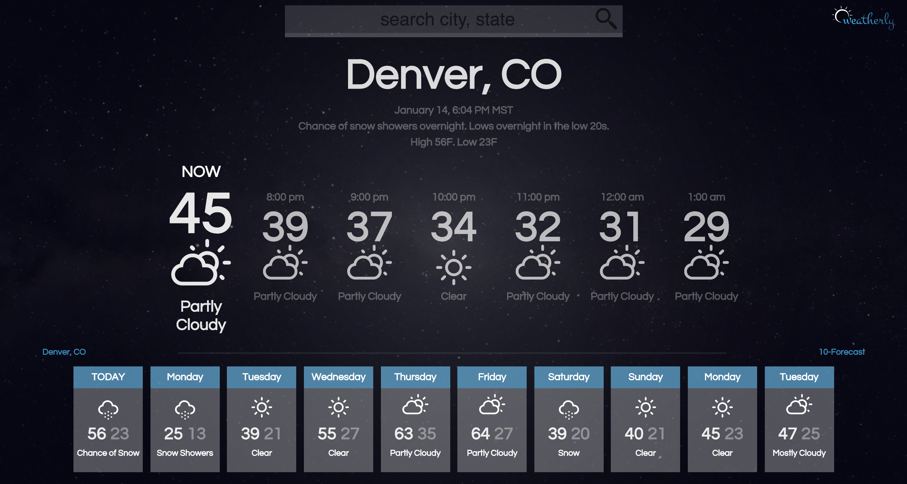

# Weatherly 

Weatherly is built in React, pulling data from the Weather Underground API, and is tested in Jest/Enzyme.  Cities can be found using autocomplete functionality that we built in a previous project.  Some graphics are custom-made, including the logo.  The weather icons are from Font Awesome.

It was built by students Patrick Neel and Rob Morgan in one week.  Weatherly was our first project using an API, using React, and testing with Jest.  The styling is our own.  It is mobile-friendly and displays well on all screen sizes.

See live version at https://patrickjneel.github.io/weatherly/

********

### Screenshot

